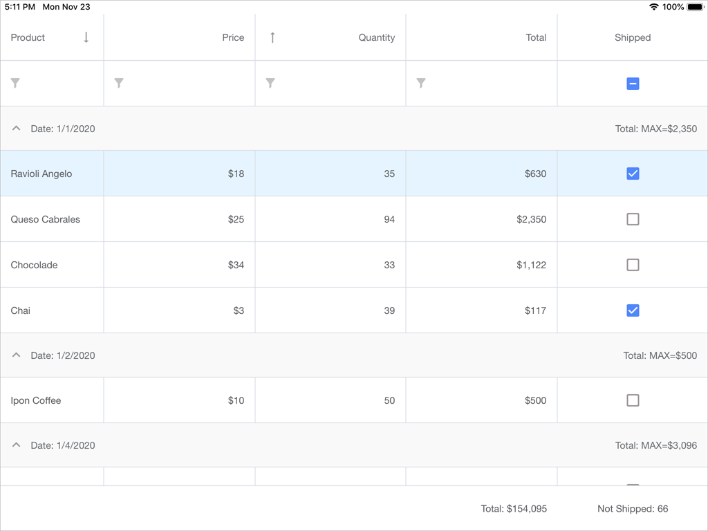

<!-- default file list -->
*Files to look at*:

* [Order.cs](./DataGrid_GettingStarted/DataModel/Order.cs)
* [Product.cs](./DataGrid_GettingStarted/DataModel/Product.cs)
* [OrderRepository.cs](./DataGrid_GettingStarted/DataModel/OrderRepository.cs)
* [ModelObject.cs](./DataGrid_GettingStarted/DataModel/ModelObject.cs)
* [MainPage.xaml](./DataGrid_GettingStarted/MainPage.xaml)
* [MainPage.xaml.cs](./DataGrid_GettingStarted/MainPage.xaml.cs)
<!-- default file list end -->
# Data Grid - Getting Started

The example contains the source code of the application created in the [Getting Started](https://docs.devexpress.com/MobileControls/400546/xamarin-forms/data-grid/getting-started/index) tutorial. It demonstrates the basic functionality of the [DevExpress DataGridView for Xamarin.Forms](https://docs.devexpress.com/MobileControls/DevExpress.XamarinForms.DataGrid.DataGridView), and includes the following steps:
- [Bind Grid to Data](https://docs.devexpress.com/MobileControls/400547/xamarin-forms/data-grid/getting-started/lesson-1-bind-a-grid-to-data)
- [Create Grid Columns](https://docs.devexpress.com/MobileControls/400548/xamarin-forms/data-grid/getting-started/lesson-2-create-grid-columns)
- [Group Data](https://docs.devexpress.com/MobileControls/400550/xamarin-forms/data-grid/getting-started/lesson-3-group-data)
- [Calculate Summaries](https://docs.devexpress.com/MobileControls/400551/xamarin-forms/data-grid/getting-started/lesson-4-calculate-summaries)
- [Sort Data](https://docs.devexpress.com/MobileControls/400552/xamarin-forms/data-grid/getting-started/lesson-5-sort-data)
- [Filter Data](https://docs.devexpress.com/MobileControls/400553/xamarin-forms/data-grid/getting-started/lesson-6-filter-data)

To run the application:
1. [Obtain your NuGet feed URL](http://docs.devexpress.com/GeneralInformation/116042/installation/install-devexpress-controls-using-nuget-packages/obtain-your-nuget-feed-url).
2. Register the DevExpress NuGet feed as a package source.
3. Restore all NuGet packages for the solution.
