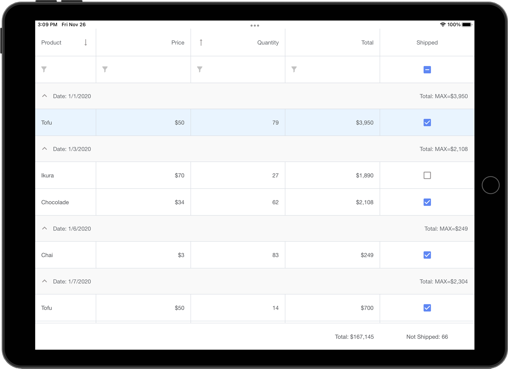

<!-- default badges list -->

<!-- default badges end -->

## Mobile UI for Xamarin.Forms - Data Grid

[DevExpress Mobile UI](https://www.devexpress.com/xamarin/) allows you to use a .NET cross-platform UI toolkit and C# to build native apps for iOS and Android.

The **DevExpress Mobile UI for Xamarin.Forms and .NET MAUI** is free of charge. To learn more about our offer and reserve your copy, please visit the following webpage: [Free DevExpress Mobile UI for Xamarin.Forms and .NET MAUI](https://www.devexpress.com/xamarin-free).

### Requirements

Please register the DevExpress NuGet Gallery in Visual Studio to restore NuGet packages used in this solution. See the following topic for more information: [Get Started with DevExpress Mobile UI for Xamarin.Forms](https://docs.devexpress.com/MobileControls/403540/xamarin-forms/get-started).

### What's in This Repository

This repository contains examples that illustrate the [DataGridView](https://docs.devexpress.com/MobileControls/DevExpress.XamarinForms.DataGrid.DataGridView)'s features.

The solution in this repository contains the following projects for iOS and Android:

- [Getting Started](./CS/GettingStarted)  
- [Grid Columns](./CS/Columns)
- [Multi-Row Column Layout](./CS/AdvancedColumnLayout)
- [In-Place Editors](./CS/InPlaceEditors)
- [Edit Form](./CS/EditForm)
- [Custom Edit Form](./CS/EditFormTemplate)
- [In-Place Editor Validation](./CS/ValidateInPlaceEditors)
- [Edit Form Validation - ValidateCell Event](./CS/ValidateCellEvent)
- [Edit Form Validation - ValidateForm Event](./CS/ValidateFormEvent)
- [Pull to Refresh](./CS/PullToRefresh)
- [Load More](./CS/LoadMore)
- [Swipe Actions](./CS/Swipe)
- [Custom Appearance](./CS/CustomAppearance)
- [Column Header Template](./CS/ColumnHeaderTemplate)

In Visual Studio, select the startup project and run the application.

### Documentation

- [Data Grid](http://docs.devexpress.com/MobileControls/400543/xamarin-forms/data-grid/index)
- [Charts](http://docs.devexpress.com/MobileControls/400422/xamarin-forms/charts/index)
- [Scheduler](http://docs.devexpress.com/MobileControls/400676/xamarin-forms/scheduler/index)
- [Collection View](http://docs.devexpress.com/MobileControls/402074/xamarin-forms/collection-view/index)
- [Navigation](http://docs.devexpress.com/MobileControls/400544/xamarin-forms/navigation-controls/index)
- [Data Form](https://docs.devexpress.com/MobileControls/401732/xamarin-forms/data-form/index)
- [Data Editors](https://docs.devexpress.com/MobileControls/401613/xamarin-forms/editors/index)

### More Examples

* [Stocks App](https://github.com/DevExpress-Examples/xamarin-forms-stocks-app)
* [Demo Center](https://github.com/DevExpress-Examples/xamarin-forms-demo-app)
* [Charts](https://github.com/DevExpress-Examples/xamarin-forms-chart-examples)
* [Scheduler](https://github.com/DevExpress-Examples/xamarin-forms-scheduler-examples)
* [Collection View](https://github.com/DevExpress-Examples/xamarin-forms-collection-view-examples)
* [Navigation](https://github.com/DevExpress-Examples/xamarin-forms-navigation-examples)
* [Data Form](https://github.com/DevExpress-Examples/xamarin-forms-data-form-examples)
* [Data Editors](https://github.com/DevExpress-Examples/xamarin-forms-editors-examples)